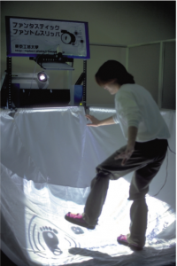

# Fantastic Phantom Slipper

## Fantastic Phantom Slipper [1997-1998]

The first project of the “Interactive Floors” series. Most virtual reality systems use upper body parts, such as eyes, ears, arms and hands, for the interactions, and much information is concentrated into them. This situation is caused by some restrictions of current interface devices. People should be able to move and act freely in virtual environments as they do in the real world. People usually move with their legs and feet in the real world. We believe that they should be able to move freely with their legs and feet in virtual worlds.

From this viewpoint, we have developed a multi-modal interface using human feet. Feet movements of the users are measured by a real-time optical motion capture system. The feedback information is transmitted to the users through tactile sensation on the feet, namely to the soles. These functions are realized by specially developed slippers. The only device the user should wear is a pair of slippers, and he/she can move and act freely.

Since we are accustomed to wear shoes, wearing such slippers, do not cause psychological/physical discomforts. Utilizing key technologies we developed, we constructed an interactive amusement system using a foot interface, the "Fantastic Phantom Slipper".

The system has been realized with a real-time optical motion capture system using PSD and Infrared-LEDs. In the system, two LEDs are fixed on each slipper. The locations and directions of slippers on the floor are measured in real-time. Since feet are usually on the floor, two dimensional measurement is sufficient for this application.

The another key technology is the “Phantom Sensation”, a special psycho-physical phenomenon on human skin. When two mechanical stimuli of the same intensity are applied to different locations of skin surface with appropriate spacing, the two stimuli are fused and one sensation is perceived. When the intensity of one stimulus increases, the location of fused sensation shifts to the location of stronger stimulus. This psycho-physical phenomenon has been known as phantom sensation, which was found by Bekesy, a Novel Prize Winner in 1961. This project was realized before the rumble pad of game controllers as known as vibrotactile.

When people walk, various kinds of information, such as pressure, ruggedness and inclination of floors, are perceived through the skin sensations of their soles. We employ phantom sensation to transmit such kinds of information. In order to elicit phantom sensation, we use tiny vibration motors. The vibrators are set in the sole of the slippers. Two vibrators are set in each sole. Fused sensation can be moved two dimensional around the feet, by controlling the intensities of the four vibrators appropriately. Fantastic Phantom Slipper is shown at VRSJ’97 (Virtual Reality Annual Conference in Japan) and ACM SIGGRAPH’98 Enhanced Reality.

<a href="./img/Filpper.gif"> </a>

<h2>Video</h2>

[YouTube](https://www.youtube.com/watch?v=vU_SBt7GJ6A)

<iframe width="560" height="315" src="https://www.youtube.com/embed/vU_SBt7GJ6A" frameborder="0" allow="accelerometer; autoplay; encrypted-media; gyroscope; picture-in-picture" allowfullscreen></iframe>

<h2>Academic articles</h2>

<code>
白井暁彦, 佐藤勝, 久米祐一郎, 草原真知子, 「ファンタスティック・ファントム・スリッパ」,
日本バーチャルリアリティ学会大会論文集  (Proceedings of the Virtual Reality Society of Japan Annual Conference),
2nd, pp. 27-28, 1997/Sep., DOI=<a href="https://jglobal.jst.go.jp/detail?JGLOBAL_ID=200902119698897464">https://jglobal.jst.go.jp/detail?JGLOBAL_ID=200902119698897464</a>
</code>

<code>Yuichiro Kume. 1998. Foot interface: fantastic phantom slipper. In ACM SIGGRAPH 98 Conference abstracts and applications (SIGGRAPH '98). ACM, New York, NY, USA, 114-. DOI=http://dx.doi.org/10.1145/280953.284801</code> <a href="https://dl.acm.org/citation.cfm?id=284801">ACM Portal</a> [<a href="http://delivery.acm.org/10.1145/290000/284801/p114-kume.pdf">PDF</a>]

<code>白井暁彦, 佐藤勝, 草原真知子, 久米祐一郎,"足インターフェイスによる複合現実感アミューズメントシステム : ファンタスティックファントムスリッパ(<特集>複合現実感)",日本バーチャルリアリティ学会論文集, 4巻(1999) 4号, 1999年, p.691-697. DOI=<a href="https://doi.org/10.18974/tvrsj.4.4_691">https://doi.org/10.18974/tvrsj.4.4_691</a>
</code>
  
<a href="https://www.jstage.jst.go.jp/article/tvrsj/4/4/4_KJ00007553594/_article/-char/ja/">J-STAGE</a> [<a href="https://www.jstage.jst.go.jp/article/tvrsj/4/4/4_KJ00007553594/_pdf/-char/ja">PDF</a>]

