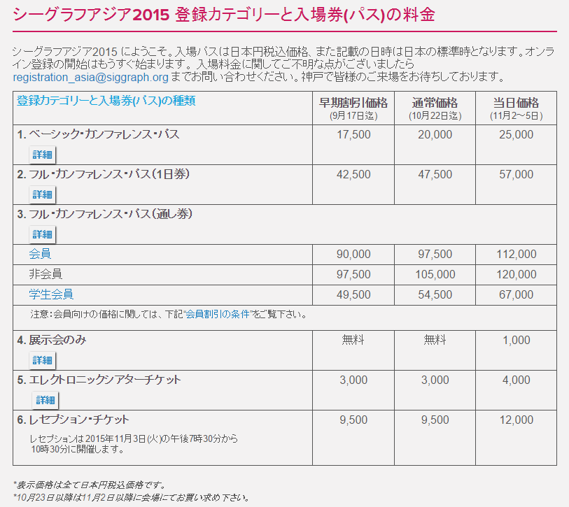

# SIGGARPH ASIA 2015 神戸

SIGGRAPH ASIA 2015 神戸の日本語ポータルです

## 【予習＆まとめ】

- [1日目みどころ・まとめ](2015-11-02-siggraph-asia-2015-day1.md)
- [2日目みどころ・まとめ](2015-11-02-siggraph-asia-2015-kobe-day2.md)
- [3日目みどころ・まとめ](2015-11-03-siggraph-asia-2015-kobe-day3.md)
- [4日目みどころ・まとめ](2015-11-05-siggraph-asia-2015-kobe-day4.md)
- [Electronic Theater](2015-11-04-siggraph-asia-2015-kobe-electronic-theater.md)

## 【便利なリンク】

- 公式サイト： http://sa2015.siggraph.org/jp/
- 日本語半公式Facebook（白井管理）： https://www.facebook.com/SA2015Kobe
- SIGGRAPH ASIA 2015神戸ローカルコミッティ： https://www.facebook.com/SA15KobeLocalcom
- このサイトのURL： http://aki.shirai.as/sa2015/
- 初心者向け情報（2015/7/28）： http://aki.shirai.as/2015/07/sa2015-guide/
- （公式）日本語みどころまとめ（プログラム概要）
- （公式）一目でわかるスケジュール（PDF: day1, day2, day3, day4）
- （公式）コンピュータ・アニメーション・フェスティバル(CAF)上映プログラム
- （公式）パーティ情報（ネットワーキング・イベント）
- 【初心者向け】SIGGRAPH ASIA 2015 Kobe登録関係まとめ
- オンライン登録が28日(水)まで延長となりました！（日本語みどころ情報）
- SIGGRAPHA ASIA 教育シンポジウム 11/3の面々が素晴らしい件（2015/10/11）： http://aki.shirai.as/2015/10/sa15-edu-sympo-1103/
- 日本語Twitter #SIGGRAPH15Kobe

#SIGGRAPH15Kobe のツイート

## ■登録関係

早期割引は10月2日まで！その後は10月23日10月28日19時(日本時間)までが通常価格（当日より安い）、かつ登録可能期間です。それ以降ですと現地登録のみになり、バッジに名前が載らない、シアターのチケットも購入できない可能性があるようです。
http://sa2015.siggraph.org/jp/registration-travel/registration-categories-fees.html

## ■神戸もりあげ情報（掲載依頼歓迎）

地元での応援も本格的に始まっているようです！
https://www.facebook.com/hyogo.sangyo

神戸市の取り組みとローカルコミッティの活動について：
http://www.city.kobe.lg.jp/information/project/innovation/siggraph/index.html #SIGGRAPH15Kobe

SIGGRAPH ASIA 2015神戸ローカルコミッティFacebook：

https://www.facebook.com/SA15KobeLocalcom

## パーティ・交流関係

- 公式ネットワーキングイベント告知もご参照

- 11月2日(月) SAKE Party/アリストンホテル神戸16階バルセロナ/入場：無料（定員250名）

「SIGGRAPH ASIA 2015」の来場者を招き、神戸が誇る日本酒を楽しんでいただきながら交流 を深める「酒パーティー」を開催いたします。ゲストとして、東京大学大学院情報学環より河口洋一郎教授をお招きいたします。
日時：　2015年11月2日（月）19:00 – 21:00
主催：　SIGGRAPH ASIA 2015ローカルコミッティ
共催：　SIGGRAPH ASIA2015カンファレンス参加メンバー有志
会場：　アリストンホテル神戸16階バルセロナ　http://www.ariston.jp/kobe/access/
兵庫県神戸市中央区港島中町6-1　TEL:078-303-5555
入場：　無料（定員250名）

- 11月3日(火) 19時から21時 公式レセプション

※10/28現在、「単体でのレセプションチケットは完売しました」との表示。残念。
シーグラフアジア2015 公式レセプション
業界関係者が一堂に会するネットワーキング・レセプションです。LEDダンスや音楽演奏のパフォーマンスも予定されています。コンピュータグラフィックスやインタラクティブ技術に携わる世界各国の業界人と情報交換が可能な有意義なイベントに是非ご参加ください。
入場資格:フルカンファレンスパス（通し券）所持者
※レセプションの入場券は登録カウンターで販売致します。
入場料：　2,000円（事前受付は完売致しました。）
会場：　神戸ポートピアホテル　南館１F　大輪田
所在地：　神戸市中央区港島中町6丁目10-1
http://www.portopia.co.jp/

- 11月4日(水) 19時～　VFX-JAPANパーティ（三宮　troop cafe）

一般社団法人VFX-JAPANは、会員を中心とした交流会を11月4日（木）19:00から
神戸市三宮にて開催致します。当日は、国内外のゲストの皆様にもご参加を頂きますので、VFX-JAPAN会員の皆様やSIGGRAPH ASIA関係者との交流を深めて頂ければと存じます。SIGGRAPH ASIA 2015 KOBEに来場される方であれば、参加可能ですので、ぜひご参加ください。会費は、ビュッフェ、フリードリンクにてVFX-JAPAN会員\3,000、非会員\5,000です。 完全予約制となりますのでご参加の方は下記からお申し込み下さい。
【詳細案内・事前予約】
https://vfx-japan.com/event20151104/
日時：　11月4日(水)19:00～21:30 (開場 18:30)
会場：　三宮　troop cafe　http://troopcafe.jp/access
兵庫県神戸市中央区北長狭通2-11-5　Tel: 078-321-3130

- 11月5日(木)19時～ CG-ARTS:プロダクションパーティ　SIGGRAPH ASIA in KOBE

2015年11月5日(木) 19:00～深夜未明／申込締切 11月3日（火）／クラブ月世界
世界から6000人ものCG関係者が集まるこの機会に、日本のCG関連プロダクション
が合同で主催するパーティを、ローカルコミッティとコラボレーションして開催 します。
開催日は、最終日の11月5日。ＤＪ、ＶＪ、ダンスあり….SIGGRAPH ASIA最後の 夜を
思いっきり、ともに盛り上がりましょう。入場料は無料。キャッシュオンデリバ リーで
飲食いただけます！以下サイトより事前にお申し込みください。
日時：　2015年11月5日(木) 19:00～深夜未明
会場：　クラブ月世界（三宮） http://gessekai.net/
兵庫県神戸市中央区下山手通1-3-8 月世界ビル　Tel:078-331-6540
申し込み： https://www.facebook.com/events/898784540210691/
https://member.cgarts.or.jp/cgarts/ais/user/Answer?qid=4454461

 

## ■FAQ

ご質問は 日本語FacebookかTwitter（@o_ob）にお寄せ下さい！中高生の質問も歓迎です！日本語Twitterハッシュタグはとりあえず #SIGGRAPH15Kobe で行きたいと思います。

### Q: メディア（報道関係者）はどうやって登録したらいいのでしょうか？

A: 北米SIGGRAPHの場合はこちらにあるようなメディア登録の基準が掲載されておりますが、ケルンメッセに問い合わせたところ「何かしらの記事を取り上げて頂けるところであれば支給する」とのことでした。「申請内容としては、基本的に媒体名、発行部数をご提示して頂くようにしておりますが、当然ブロガーやWebでの媒体もその対象としております。また特別に社内報や会員向けのものとして取り上げて頂けるところにも、こちらの判断で発行させて頂いております。現在シンガポールにてその対応をしておりますが、やはりメディアによっては日本語しか対応ができない方々もたくさんいらっしゃると思いますので、その場合こちら日本事務局の方で取り次ぐようにしております」とのことでしたので、こちらからお問い合わせ下さい。

### Q: 登録（有料分）にはクレジットカードによる支払いが必要ですか？
A: 登録者本人のクレジットカードが必要です。クレジットカードがない方の場合は、会場の受付カウンターにて現金でご購入頂く事になるそうです。なお、無料登録だけであればカードは不要なのでまずは10/28までに参加登録をすることがおすすめと思います。

### History
- Published in [aki's right brain](https://aki.shirai.as/sa2015/) at 2015-10-01
- Moved to [aki's left brain](https://projects.shirai.as/sa2015/) at 2020-08-02
