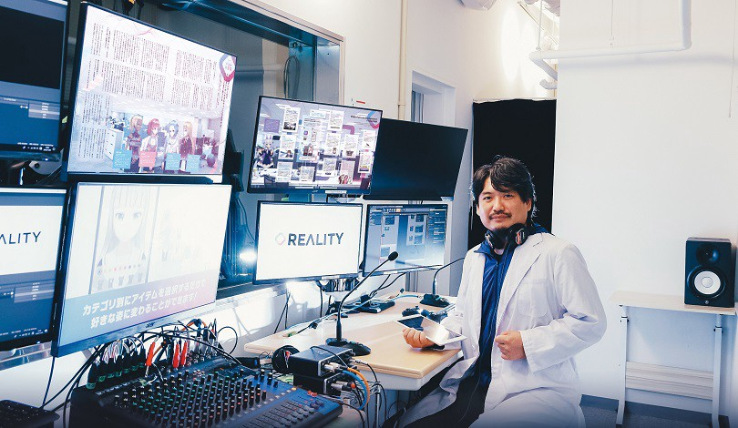
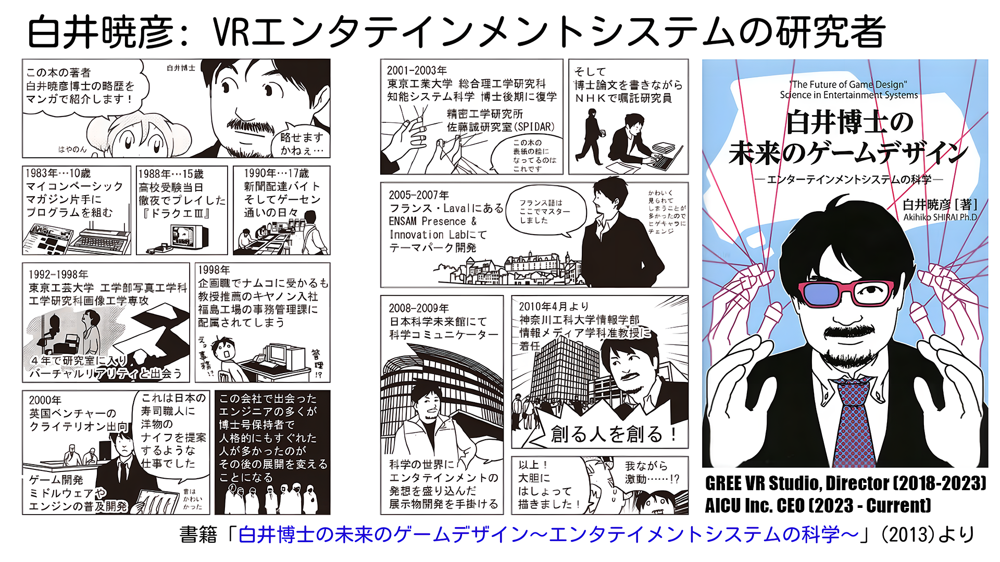
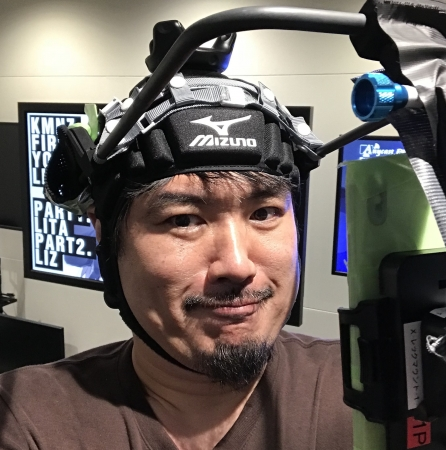

## Akihiko SHIRAI, Ph.D - CEO of AICU Inc.

### Creator{Author/CEO/Researcher} of Entertainment System

AKIHIKO SHIRAI, Ph.D. (Engineering), is a creator of AI metaverse and entertainment virtual reality. He is currently the CEO of [AICU Inc.](https://corp.aicu.ai/) and an affiliate professor of Digital Hollywood University Graduate School.

He studied photographic engineering and image processing. He developed "[Fantastic Phantom Slipper](https://akihiko.shirai.as/Fantastic-Phantom-Slipper.html)", which uses dynamic phantom sensation with vibro-tactile, as his first masterpiece in 1997.
Until 2001, he worked for Canon and Criterion as a game development consultant to market RenderWare, a multi-platform graphics middleware for the game industry. He returned to academia and received his Ph.D. from the Tokyo Institute of Technology in Japan in 2004 with research on the "Tangible Playroom", an entertainment system for young children using haptics, a floor screen, and a real-time physics engine. He was an R&D researcher at NHK-ES in Japan, focusing on the next-generation TV production environment, before moving to ENSAM Presence & Innovation Laboratory in France from 2004 to 2007 to work on R&D for a virtual reality theme park development project with some significant research projects. Rapid computer vision on GPU "[GPUVision](https://youtu.be/N4WtupBoRMI?t=172)", robotic game player "[RoboGamer](https://www.youtube.com/watch?v=2vH62EEfH6E)" and "WiiMedia" projects were accepted by ACM SIGGRAPH and IEEE VR. 

He worked for [National Museum of Emerging Science and Innovation (Miraikan)](https://www.miraikan.jst.go.jp/en/), Tokyo, Japan, as a science communicator and exhibition planner from 2008 to 2010. He worked in Information Media, Kanagawa Institute of Technology (KAIT) as an associate professor from 2010 to 2018. Simultaneous multiplex image systems "Scritter", "[ExPixel](https://www.youtube.com/watch?v=lOMx5F7aGEQ)" and "[ExField](https://www.youtube.com/watch?v=BrVJDMgVFqY)", manga immersive system "[Manga Generator](https://manga.style/manga-generator/)", nursery VR entertainment "[Real Baby - Real Family](https://www.youtube.com/watch?v=vqmMXMKX33M)" have been awarded by ministry, academia and game industry. Since 2018, he has been a visiting professor at Digital Hollywood University Graduate School. In June 2018, he returned to the entertainment industry as a research director to launch "[GREE VR Studio Laboratory](https://vr.gree.net/lab/)" in [REALITY, Inc.](https://reality.inc/).A family of [GREE, Inc.](https://corp.gree.net/jp/en/) that promotes a new XR metaverse industry. Conducting research to improve vTuber (Virtual YouTuber, Virtual Persona, Virtual Artist) and exploring XR live entertainment. Contributing to the development of new user experiences in XR entertainment and solutions such as "[VibeShare](https://vr.gree.net/lab/vibeshare/)", a suite of virtual live enchanting technologies for sharing non-verbal interaction in XR live entertainment. 

In [REALITY, Inc](https://reality.inc/), [representative of the metaverse industry in Japan](https://www.google.com/search?q=%E3%83%A1%E3%82%BF%E3%83%90%E3%83%BC%E3%82%B9&rlz=1C1GCEA_enJP946JP946&sxsrf=APq-WBvo0I_cAw-TlGHO2OEXSubTXb6TYw:1649263207297&source=lnms&tbm=isch&sa=X&ved=2ahUKEwi9tPKc8P_2AhXQdHAKHR-jCX8Q_AUoAnoECAIQBA&biw=1707&bih=802&dpr=1.13), he produces some visualizations of near-future user experiences using [REALITY.app](https://reality.app) in [UXDev projects on YouTube](https://vr.gree.net/lab/demo/uxdev/), and contributes to some PoC for B2B metaverse using [Mozilla Hubs with Japanese translation](https://github.com/gree/hubs-docs-jp) and community developments. 
affiliate professor at the [Digital Hollywood University Graduate School](https://www.dhw.ac.jp/en/academics/). 
Vice President of the [Society for Art and Science](https://art-science.org/). 
Ambassador and board member of [Laval Virtual] (https://www.laval-virtual.com/).
Latest book written: "[Collaborating with AI to become a Godhand Illustrator - How to comprehend Stable Diffusion](https://ivtv.page.link/ap)".
His motto is "Creating people who create" (from his written book in [The Future of Game Design - Science in Entertainment Systems](https://bit.ly/mirainogame)).

His latest interests in the "VR4.0 era", as he proposes, are the development of a multi-user avatar society called Metaverse, User Generated Content (UGC), Blockchain, and User Experience (UX) in AI, and in particular, his research on generative AI is presented to the general public in an easy-to-understand manner. In particular, the book "Collaborating with AI to become a Godhand Illustrator - How to comprehend Stable Diffusion" ([AIとコラボして神絵師になる 論文から読み解くStable Diffusion](https://ivtv.page.link/ap)) is a book that presents research on generative AI in an easy-to-understand manner for the general public. Diffusion was published within two months of its release and has received a great response from the community.

Since 2023, He has continued to push the boundaries of AI metaverse and virtual reality entertainment. As the CEO of [AICU Inc.](https://aicu.ai/), he leads cutting-edge research and development initiatives aimed at revolutionizing the industry. He also serves as a specially appointed Professor (特任教授) at Digital Hollywood University Graduate School.

## 白井暁彦（Akihiko Shirai, PhD /しらいはかせ ）Profile in Japanese

白井暁彦（しらい あきひこ, Akihiko SHIRAI, Ph.D）aka しらいはかせ(Hacker作家)
デジタルハリウッド大学大学院 特任教授

- Twitter[@o_ob](https://x.com/o_ob)
- [Wantedly](https://www.wantedly.com/id/akihiko_shirai_phd)

エンタメ・メタバース技術の研究開発に関わる研究者、ホワイトハッカー作家、米国スタートアップ「AICU Inc.」「Hidden Pixel Technology Inc.」のCEO。東京工芸大学写真工学科卒、同画像工学専攻修了。キヤノン株式会社とグループの研究所より生まれた英国・Criterion Software にて世界初の産業用ゲームエンジン「RenderWare」の普及開発に参加、その後、東京工業大学知能システム科学専攻に復学。博士学位後、NHK エンジニアリングサービス・次世代コンテント研究室、フランスに渡りENSAM 客員研究員、国際公募展Laval Virtual ReVolution の立ち上げ、日本科学未来館科学コミュニケーター神奈川工科大学情報メディア学科准教授を経て、2018 年よりデジタルハリウッド大学 大学院客員教授 およびグリー株式会社GREE VR Studio Laboratory Director。スマートフォン向けメタバース「REALITY」を開発・運用するREALITY 株式会社の立ち上げを通して、Virtual YouTuber などXR ライブエンタメ技術のR&D、国際発信など、メタバースエンタテイメントの未来開発や知財創出を中心に、自らエンタテイメントのライブプレイヤーとして世界に向けた開発・発信活動方法論化しながら世界中のエンタテインメント技術業界に数百人の規模でクリエイターを育成している。2023 年よりデジタルハリウッド大学発米国スタートアップ企業「AICU Inc.」CEO。生成AI 時代に「つくる人をつくる」をビジョンに英語、日本語、フランス語、プログラミング言語などでオープンな作家活動を続けている。日本バーチャルリアリティ学会IVRC 実行委員会委員。芸術科学会副会長。著書に『WiiRemote プログラミング』（オーム社）、『白井博士の未来のゲームデザイン - エンターテインメントシステムの科学-』（ワークスコーポレーション）、『AI とコラボして神絵師になる　論文から読み解くStable Diffusion』（インプレスR&D）他。

### ショートプロフィール (2023/7)
メタバース開発、VRエンタテインメントシステム、メディアアート研究、写真工学、画像工学を専門に画像生成の研究開発で30年近い経験を持つ博士(工学)。一般社団法人[芸術科学会](https://art-science.org/)副会長。[デジタルハリウッド大学大学院客員教授](https://akihiko.shirai.as/dhgs)。StableDiffusionのリリースから2ヵ月で2冊の書籍「[AIとコラボして神絵師になる](https://ivtv.page.link/aisd)」を執筆。インプレス「窓の杜」にて「[生成AIストリーム](https://forest.watch.impress.co.jp/docs/serial/aistream/index.html)」連載中。

### 略歴
VRエンタテイメントシステムの研究者。東京工芸大学工学部写真工学科卒、[工学研究科画像工学専攻修士課程修了](/PDF/9662005.pdf)。キヤノン、英国クライテリオン・ソフトウエア社で世界初の産業用ゲームエンジン開発に参加、ゲームの未来を変えるために2001年 東京工業大学大学院総合理工学研究科知能システム科学専攻博士後期課程に復学、2003年「VRエンタテイメントシステム」の研究で博士 (工学)の学位を取得。2003年-2004年に財団法人NHKエンジニアリングサービス・次世代コンテント研究室。2004年末にフランスに渡り、以来日仏のVR研究の架け橋となる。2007年より帰国し、日本科学未来館科学コミュニケーターを経て、神奈川工科大学 情報学部情報メディア学科 准教授。位置情報ゲームの活用や多重化映像システムなど幅広く研究。著書「白井博士の未来のゲームデザイン -エンターテインメントシステムの科学」他、MoguraVRにて「白井博士のVRおもしろ相談室」を連載。2018年6月1日よりグリー株式会社に入社。[GREE VR Studio Laboratory](https://vr.gree.net/lab) Directorを担当する。アバター駆動のメタバース、VRライブエンタテイメントを中心としたUX研究開発のリーダーとして、VRエンタテイメントシステムの研究開発・人材育成・発信活動、新しい世代のUXを開拓。ACM SIGRAPH, IEEE MetaCom, Laval Virtual, CEDECなどの国際的なインタラクティブ技術・UX研究の先端において常に最先端のUXを提案してきた。2023年よりデジタルハリウッド大学大学院にてラボプロジェクト「クリエイティブAIラボ」を主宰。生成AIとサービス開発における実験的な取り組みをより社会において実験する活動を推進している。

### 受賞歴（抜粋）
- Hello Tomorrow Global Summit Top 500 startups “Multiplex World Augmentation Display"
- ACM SIGGRAPH ASIA 2012 Emerging Technologies Prize，
- ACM Student Research Competition, Bronze Award, Laval Virtual Award 2015，
- 経産省Innovative Technologies 2013受賞（「2x3D」2D+3D互換の多重化ディスプレイシステム），CEDEC2012 インタラクティブセッション大賞，- CEDEC2014 インタラクティブセッション3位，CEDEC2016 インタラクティブセッション「オーディエンス賞」2位，ニコニコ超会議2015「第8回 ニコニコ学会β シンポジウム」（来場者15万人）にて会場投票で1位となる金賞を受賞, 他．

### Media presences 

- フジテレビ「週刊フジテレビ批評」2023/8/25 予定
[生成ＡＩでメディアはどう変わるのか？驚きの最先端技術をスタジオ実演！ハリウッドのデモの要因にも･･･未来への展望と課題を検証](https://twitter.com/FUJICC_staff2/status/1692734674416885850)

-　NHK「漫画家イエナガの複雑社会を超定義」 2023/5/12 放映
[【漫画で解説】注目のバズワード「ジェネレーティブAI」が社会を変える！？](https://www.nhk.jp/p/ts/1M3MYJGG6G/blog/bl/pp2BabPyzp/bp/pJv5r5m1OD/)

### 所属学会等
- 日本VR学会
  - 国際学生VRコンテスト（[IVRC](https://ivrc.net/)）実行委員
- 芸術科学会
- 情報処理学会、映像情報メディア学会、
- Laval Virtual Administrative Council (France)

### Contact

[Contact Form](https://wellwhite.wixsite.com/home/contact) / [Twitter@o_ob](https://twitter.com/o_ob)

### GitHub Calendar

<link
  rel="stylesheet"
  href="https://unpkg.com/github-calendar@latest/dist/github-calendar-responsive.css"
/>

    Loading the data just for you.

# Research

- [GREE VR Studio Laboratory](https://vr.gree.net/lab/)
  - [GREE VR Studio Laboratory - Publication](https://vr.gree.net/lab/#papers)
  - [GREE VR Studio Laboratory - YouTube](https://j.mp/VRSYT)
- [Research Gate](https://www.researchgate.net/profile/Akihiko_Shirai)

## Works

## GREE VR Studio Laboratory (2018-)

- [UXDev](https://vr.gree.net/lab/uxdev/)
- [VR Game Products](https://vr.gree.net/en/)
- [Laboratory](https://vr.gree.net/lab/)
- [YouTube Channel](http://j.mp/VRSYT)
- [「転生こえうらない」Voice Fortune Teller](https://vr.gree.net/lab/vc/)
- [VibeShare](https://vr.gree.net/lab/demo/vibeshare/)
 - [Let's go travel around the world virtually](https://vr.gree.net/lab/live/kws2021/)
- [REALITY](https://reality.app/)
 - [UXDev Project](https://vr.gree.net/lab/demo/uxdev/)
  - [“Metaverse Christmas”](https://www.youtube.com/watch?v=0eKx-mlRNd4)
  - ["Back to Metaver-School" - a blooming future of Metaverse in REALITY](https://www.youtube.com/watch?v=1JlD6XF2HNI)

 

### Events

1. [VRSionUp! #1 高校生VRを国際会議へ／VRChatを科学の研究に／ボイスチェンジャ探求](https://gree.connpass.com/event/112901/) (2019/1/11)
1. [VRSionUp! #2 「Laval Virtual 2019 & バーチャルマーケット２予習会」](https://gree.connpass.com/event/117456/) (2019/3/1)
1. [#VRSionUp! #3 「LavalVirtual2019公式報告会&VTuber番組技術特集」](https://gree.connpass.com/event/122745/) (2019/4/12)
1. [#VRSionUp!4「VRエンタメxEdu」](https://gree.connpass.com/event/128401/) (2019/5/17)
1. [#VRSionUp!5「kawaiiムーブ研究」](https://gree.connpass.com/event/131231/) (2019/6/21)
1. [#VRSionUp!6「先端ボイチェン研究」](https://gree.connpass.com/event/134082/) (2019/7/16)
1. [#VRSionUp!7「Hubs Study」](https://gree.connpass.com/event/176160/) (2020/7/15)
1. [HubsでもくもくBlenderワークショップ(1)体験会 #VTC20](https://connpass.com/event/186321/) (2020/8/27)
1. [HubsでもくもくBlenderワークショップ(2)体験会 #VTC20](https://connpass.com/event/187027/) (2020/9/24) 
1. [#VRSionUp!8「WebVRオンラインイベント開発」](https://gree.connpass.com/event/187716/) (2020/9/8)
1. [#VRSionUp!9「#IVRC2022 に挑戦！フランス遠征報告会」 ](https://connpass.com/event/248356/) (2020/5/21)
1. [#VRSionUp!10「国際会議に挑戦！ #SIGGRAPHAsia2022 報告会」](https://connpass.com/event/268059/) (2022/12/13)
1. [#VRSionUp!11「mocopiで遊ぼう♪」](https://connpass.com/event/275769/) (2023/2/22)
1. [#VRSionUp!12「Laval Virtual 2023直前特集」](https://connpass.com/event/278095/) (2023/3/22)
1. [メタバース開発もくもく会 #VTC23](https://connpass.com/event/279669/) (2023/4/20)

## Patents

1. Information display apparatus WO US CN JP US9769442B2
1. Video delivery system, video delivery method, video delivery program, JP JP2020109935A
1. Video distribution system, video distribution method, and video distribution, US JP US20220038777A1
1. Computer program, server, terminal, and speech signal processing method, WO US JP US20210335364A1
1. Computer Program, Server Device, Terminal Device and Method, US JP US20210099735A1
1. Video distribution system, video distribution method, video distribution, WO US US20220070513A1
1. Server device, terminal device, and display method for controlling facial, WO US JP US20210312167A1

[Full List](https://patents.google.com/?inventor=Akihiko+SHIRAI&oq=Akihiko+SHIRAI)

### "Laval Virtual ReVolution" (Session Chair, exhibition curation)

 * [2019] VR5.0
 * [2018] 1+1=∞ (one plus one equals unlimited)
 * [2017] TransHumanism++
 * [2016] REAL VIRTUALITY
 * [2015] Kiddy Dream in Virtual Reality
 * [2014] Frontier village in Virtual Reality
 * [2013] The NEXT BIG STEP
 * [2012] Virtual Reality That Moves You
 * [2011] Converging
 * [2010] Diverseness
 * [2009] ReVolution Causes Revolutions
 * [2008]World Performance of VR Applications

### KAIT Shirai Lab (2010-2018)

- [Publications](http://blog.shirai.la/publications/)
- [Manga Generator Consortium](https://manga.style/)

### Legacy Projects

- [Fantastic Phantom Slipper](https://akihiko.shirai.as/Fantastic-Phantom-Slipper.html)
- [BookWii](https://akihiko.shirai.as/projects/BookWii/index.html)
- [SIGGRAPH ASIA 2015 Kobe](https://akihiko.shirai.as/projects/sa2015/)
- [projects.shirai.as](https://projects.shirai.as/)

# Lecture

### Lecuture and Talks (part)

#### 2023

1. Developers Summit 2023「AI神絵師はITエンジニアの未来をどう変えるのか？～メタバースR&DからみたAI画像生成のトレンド～」[Web](https://event.shoeisha.jp/devsumi/20230209/session/4191/) [Slides](https://vr.gree.net/wp-content/uploads/2023/02/DevSumi20230210.pdf) 2023/2/10

#### 2022

1. 「メタバース時代の人間の界面：アバター技術とUXの探求～REALITY と GREE VR Studio LaboratoryのR&D活動紹介」, 画像電子学会 Advanced Image Seminar 2022, (2022/6/14) [Web](https://www.iieej.org/events/ais2022/)

#### Past Talks

1. "REALITY: We can be whoever we want - Avatar driven metaverse service and UX R&D #SIGGRAPHAsia2021", [SIGGRAPH ASIA 2021  CG In Japan](https://www.youtube.com/watch?v=VpfjRFD4fhw), 2021/Dec/14
1. "Since VR Entertainment, dawn of XR Metaverse - Development and Deployment for next generation of human being", [ICAT-EGVE 2021 Keynote](https://icat-egve-2021.org/index.php/keynotes/), 2021/Sep/08
1. "What is happening in Japanese CG research and industry now? WFLE: Beyond VTuber to Live Entertainment", [SIGGRAPH 2020 IRC](https://docs.google.com/presentation/d/19fHo9PRxz8hn5bYFcrl-uezbxK21YwxIb4W1ht92z84/edit#slide=id.g9274a76f41_13_85)
1. Virtual Beings World "New Play Together", [SIGGRAPH 2020 BoF](https://www.slideshare.net/vrstudiolab/virtual-beings-world-new-play-together-siggraph-2020-bof)
1. Game.Impulse, University of Applied Sciences Bonn-Rhein-Sieg, 2021/6/9 [Web](https://www.h-brs.de/de/isf/termin/gameimpulse-Akihiko_Shirai)
1. [“Research and Development for Avatar-Driven Virtual Society in VR4.0 Era” #EMTECH #DesiredIdentities](https://www.youtube.com/watch?v=hVR82Rb7eqM) Published on June 27,2020

## Slide portal

- [SlideShare@GREEVRStudioLab](https://www.slideshare.net/vrstudiolab/)
- [SlideShare@AkihikoSHIRAI](https://www.slideshare.net/aquihiko)

## Digital Hollywood University

- [Digital Hollywood University Graduate School](https://www.dhw.ac.jp/en/academics/)
- [Lectures and Projects in DHGS](https://akihiko.shirai.as/dhgs/)

### Misc

- "WFLE: Beyond VTuber to Live Entertainment", What is happening in Japanese CG research and industry now?, In SIGGRAPH 2020 Birds of a Feather, 2020/Aug/25, [Announce](https://twitter.com/siggraph_irc/status/1298209673783345152?s=20)
- [Mozilla Hubs が拓く新世代 WebVR のススメ #HubsScrum](https://www.slideshare.net/vrstudiolab/mozilla-hubswebvr-hubsscrum) Published on May 13, 2020
- [聚逸虚拟现实工作室总监 白井晓彦：研究创新是为了更好地娱乐](http://www.cena.com.cn/tablet/20191023/102949.html) DIC2019 10 月 22 日 23 日, China.
- [SIGGRAPH Asia 日本語完全ガイド～初めての参加者ために](https://www.slideshare.net/aquihiko/siggraph-asia-2018-acm-tokyo-20181204) SIGGRAPH ASIA 2018 Tokyo (2018 年 12 月 4 日)
- [WiiRemote Programming Workshop - 革新的インタラクションを構成する“部品としての”ゲームコントローラー](https://www.slideshare.net/aquihiko/wiiremote-programming-workshop), JAIST, 2009/11/20
- [Virtual Realty for Entertainment - 文化・言語背景を 文化・言語背景を超えた環境における国際的エンタテイメントシステムデザイン](https://www.slideshare.net/aquihiko/virtual-realty-for-entertainment) JAIST, 2006/11
- <a href="http://kaitas.github.io/PDF/SIG-GT20040410Web.pdf" onclick= "ga('send', 'event', 'download','click','/PDF/SIG-GT20040410Web.pdf');">ゲーム開発業の未来を支える産学連携－日本式 Ludology 事始－</a> IGDA 日本 ゲームテクノロジー研究会 第 1 回 研究会(2004 年 1 月 10 日)(<a href="https://www.slideshare.net/aquihiko/igda-1/aquihiko/igda-1">Detail in SlideShare</a>)

# Books (new to old)

1. [画像生成AI Stable Diffusion スタートガイド](https://j.aicu.ai/SBXL)
1. [AIとコラボして神絵師になる 論文から読み解くStable Diffusion](https://ivtv.page.link/ap) 
1. [白井博士の未来のゲームデザイン ―エンターテインメントシステムの科学―](http://aki.shirai.as/entsys/)
1. [WiiRemote プログラミング](http://akihiko.shirai.as/projects/WiiRemote/)

## Online Publications

1. CGWORLD特集 メタバース開発者の卵が「自分は何者か」を発見する場所【GREE VR Studio Laboratoryリサーチ系インターンシップ】2023/02/16 [Web](https://cgworld.jp/article/202302-greevr.html)
1. 「これまでの 5 年、これからの 5 年――「VR 元年」の終焉から世界同時参加の XR ライブエンタメへ」（メディア芸術カレントコンテンツ：文化庁）2020年10月29日
   [https://mediag.bunka.go.jp/article/article-16853/](https://mediag.bunka.go.jp/article/article-16853/)

## 技術書典

1. 白井暁彦他,「AIとコラボして人気絵師になる」，グリー技術書典部誌 2022 年秋号，[Web](https://techbookfest.org/product/4GwQ9v4qrgaAuT2cQGAGt9?utm_source=twitter&utm_medium=social&utm_campaign=share)
1. 白井暁彦他,「Mozilla Hubs を用いたオンラインイベント WebVR 化テクニック」,グリー技術書典部誌 2020 年秋号, [Web](https://techbookfest.org/product/5759878496780288?productVariantID=6214599038730240)

1. 白井暁彦他,「Virtual Cast と Hapbeat を使った国際双方向アバター触覚ライブの開発」,グリー技術書典部誌 2020 年春号, [Web](https://techbookfest.org/product/5694096500850688?productVariantID=6015509631860736)

<h1 id="papers">Academic Papers</h1>

#### 2023

1. 白井暁彦「文化・技術・研究史で読み解く令和のメタバースの研究開発」,電子情報通信学会, 通信ソサイエティマガジン No.64 春号 2023, p.285-294 [PDF](https://www.jstage.jst.go.jp/article/bplus/16/4/16_285/_pdf)

#### 2022

1. Takuma Kato, Tomosuke Nakano, Takanori Horibe, Miku Takemasa, Yusuke Yamazaki, Akihiko Shirai, “Cross-platforming “School life metaverse” user experience”, SIGGRAPH Asia 2022 Posters (2022/12/01) [Web](https://sa2022.siggraph.org/en/presentation/?id=pos_198&sess=sess189)[DOI](https://dl.acm.org/doi/10.1145/3550082.3564200)

2. Yusuke Yamazaki, Takanori Horibe, Akihiko Shirai, “Evaluation of time-shifted emotion through shared emoji reactions in a video watching experience”, CyberWorld2022 (2022/9/27) [SlideShare](https://www.slideshare.net/vrstudiolab/evaluation-of-timeshifted-emotion-through-shared-emoji-reactions-in-a-video-watching-experience-cyberworlds2022)[IEEE Explore](https://ieeexplore.ieee.org/document/9937393) Best short paper award

3. 白井暁彦, 「メタバースの定義，歴史と事例からみる 今後のビジネス展望」 研究開発リーダー Vol.19, No.1 2022, pp.57-60. (2022/4/20) [PDF](https://vr.gree.net/wp-content/uploads/2022/07/Metaverse-202204.pdf)

4. 中野友介, 加藤琢磨, 武政実玖, 堀部貴紀, 白井暁彦, “Metaverse Christmas”, 映像表現・芸術科学フォーラム2022 (2022/03/08) [Web](https://www.ite.or.jp/ken/paper/20220308yAKd/)

5. 山崎勇祐, 白井暁彦, “VibeShare::Maptop – 写真撮影・同時参加型バーチャル旅行システムの開発と評価”, インタラクション2022 (2022/02/21) [Web](http://www.interaction-ipsj.org/proceedings/2022/data/bib/1D03.html)

#### 2021

1. 白井暁彦, 中野友介, 堀部貴紀, ボイスチェンジャーサービスの研究開発を通したインターンによる次世代人材育成(Developing next-generation creators through research and development in voice changer services), デジタルハリウッド大学 研究紀要第 8 号, (2021/11/25), [PDF](https://msl.dhw.ac.jp/wp-content/uploads/2021/11/DHUJOURNAL2021_P040.pdf), [SlideShare](https://www.slideshare.net/vrstudiolab/ss-250792325)

1. 山崎勇祐(REALITY 株式会社/東京工業大学大学院), 白井暁彦「VibeShare::Performer — Emoji・触覚・音効によるオンライン音楽ライブの双方向化」, 第 26 回日本バーチャルリアリティ学会大会 (2021/9/21). [Web](http://conference.vrsj.org/ac2021/program/program-flash01.html) [PDF](https://vr.gree.net/wp-content/uploads/2021/07/VRSJ2021_VibeShare.pdf)

1. 堀部貴紀(REALITY/明治大)，橋本順之(グリー)，白井暁彦(REALITY)，森勢将雅(明治大), 「FFT ライブラリを対象とした実時間 Vocoder の速度比較」, 日本音響学会 2021 年秋季研究発表会(2021/9/7)

1. Yusuke Yamazaki, Akihiko SHIRAI, “Pseudo Real-Time Live Event: Virtualization for Nonverbal Live Entertainment and Sharing”, Laval Virtual 2021 ConVRgence, 2021/7/7. [Web](https://ijvr.eu/article/view/4797) [Abstract](https://vr.gree.net/wp-content/uploads/2021/07/VRIC2021-PseudoRealTimeLiveEvent-VirtualizationforNonverbalLiveEntertainmentAndSharing.pdf) [Poster](https://vr.gree.net/wp-content/uploads/2021/07/ConVRgence2021_poster_Pseudo_Real-Time_Live_Event.pdf)

1. 堀部貴紀(REALITY/明治大)，白井暁彦(REALITY)，森勢将雅(明治大),「『転声こえうらない』を通したボイスチェンジャー品質改善のための定性分析と考察」, 日本音響学会 2021 年春季研究発表会, [Web](https://www.mtg.acoustics.jp/poster.html#2-2P-9), [Slides](https://vr.gree.net/wp-content/uploads/2021/04/ASJ2021S-Slides-20210311.pdf), [SlideShare](https://www.slideshare.net/vrstudiolab/ss-245769023) (2021/3/11)

1. 山崎勇祐, 白井暁彦, 「VibeShare:Vote ～オンラインでの出演者と観客の非言語コミュニケーションの実現～」, 映像表現・芸術科学フォーラム 2021（Expressive Japan 2021), [Abstract](https://www.ite.or.jp/ken/paper/20210308MAJt/), [Slides](https://vr.gree.net/wp-content/uploads/2021/04/ArtSciForum-20210308.pdf), [SlideShare](https://www.slideshare.net/vrstudiolab/vibeshare-vote) (2021/3/8)

#### 2020

1. 白井暁彦, 「賛助会員紹介 グリー株式会社／ REALITY 株式会社 GREE VR Studio Laboratory」, 日本バーチャルリアリティ学会誌第 25 巻 4 号 (2020/12/31) [Web](https://www.jstage.jst.go.jp/article/jvrsj/25/4/25_43/_article/-char/ja)

1. 白井 暁彦, ブレディキーナ リュドミラ, 坂口 塔也, 栢之間 諒汰, 堀部 貴紀, 山崎 勇祐, 中村 清人, 「[Mozilla Hubs を用いたオンラインイベントの WebVR 化](https://msl.dhw.ac.jp/wp-content/uploads/2020/11/DHUJOURNAL2020_P045.pdf)」, DHU JOURNAL, Vol.07, [電子版](https://msl.dhw.ac.jp/journal/)）(Nov 2020)

1. Liudmila Bredikhina, Toya Sakaguchi, Akihiko Shirai, “Web3D Live Distance Workshop for Children in Mozilla Hubs”, Web3D ’20: The 25th International Conference on 3D Web Technology, 9th, November 2020, Article No. 27, Pages 1–2. [Web](https://dl.acm.org/doi/10.1145/3424616.3424724) [Best Poster Awards 2nd Prize](https://web3d.siggraph.org/web3d-live-distance-workshop-for-children-in-mozilla-hubs/)

1. 坂口塔也, 山崎勇祐, Bredikhina Liudmila, 白井暁彦, 「交流型 WebVR における空間音響のオンライン評価手法」, 第 25 回日本バーチャルリアリティ学会大会論文集, 2020-9-16 [PDF](http://conference.vrsj.org/ac2020/program/doc/3D2-1_PR0182.pdf)

1. 堀部 貴紀, 石原 達馬, 白井 暁彦, 森勢 将雅; [『転声こえうらない』利用者の基本周波数分析](http://www.isc.meiji.ac.jp/~mmorise/lab/publication/paper/IPSJ-MUS20127018.pdf), [情報処理学会研究報告](https://ipsj.ixsq.nii.ac.jp/ej/?action=pages_view_main&active_action=repository_view_main_item_detail&item_id=204756&item_no=1&page_id=13&block_id=8), 2020-05-30 [Web](http://id.nii.ac.jp/1001/00204661/) [SlideShare](https://es.slideshare.net/mobile/vrstudiolab/full-version-236360511) [Awarded](http://www.fms-meiji.jp/archives/1399)

#### 2019

1. [VR4.0 -リアルタイムバーチャルキャラクターが牽引する VR 産業における基盤研究](https://msl.dhw.ac.jp/wp-content/uploads/2020/04/DHUJOURNAL2019_P82.pdf) DHU JOURNAL Vol.06 (2019/11/29)

1. Yusuke Yamazaki, Hironori Mitake, Akihiko Shirai, Shoichi Hasegawa, "Widespread Hapbeat: Tension Based Necklace Type Haptic Display", Proceedings of the International Display Workshops Volume 26 (IDW '19), 2019/11/27, [DOI](https://doi.org/10.36463/idw.2019.1656) [PDF](https://confit.atlas.jp/guide/event-img/idw2019/INP3-1/public/pdf_archive?type=in)

1. Akihiko Shirai, "REALITY: broadcast your virtual beings from everywhere", In ACM SIGGRAPH 2019 Appy Hour (SIGGRAPH ’19). Association for Computing Machinery, New York, NY, USA, Article 5, 1–2. [DOI](https://doi.org/10.1145/3305365.3329727)

1. Yusuke Yamazaki, Shoichi Hasegawa, Hironori Mitake, and Akihiko Shirai. 2019. "Neck strap haptics: an algorithm for non-visible VR information using haptic perception on the neck", In ACM SIGGRAPH 2019 Posters (SIGGRAPH ’19). Association for Computing Machinery, New York, NY, USA, Article 60, 1–2. [DOI](https://doi.org/10.1145/3306214.3338562)

1. Rex Hsieh, Akihiko Shirai, and Hisashi Sato. 2019. "Effectiveness of facial animated avatar and voice transformer in elearning programming course", In ACM SIGGRAPH 2019 Posters (SIGGRAPH ’19). Association for Computing Machinery, New York, NY, USA, Article 82, 1–2. [DOI](https://doi.org/10.1145/3306214.3338540)

1. Rex Hsieh, Akihiko Shirai, Hisashi Sato, "Evaluation of Avatar and Voice Transform in Programming E-Learning Lectures", In Proceedings of the 19th ACM International Conference on Intelligent Virtual Agents (IVA ’19). Association for Computing Machinery, New York, NY, USA, 197–199. [DOI](https://doi.org/10.1145/3308532.3329430)

1. 舘暲, 岩田洋夫, 安藤英由樹, 小泉直也, 中村拓人, 吉元俊輔, 白井暁彦, 長谷川晶一, IVRC2019（第 27 回 国際学生対抗バーチャルリアリティコンテスト）開催報告, 日本バーチャルリアリティ学会誌, 2019, 24 巻, 4 号, p. 39-43, 公開日 2021/04/08 [Web](https://www.jstage.jst.go.jp/article/jvrsj/24/4/24_39/_article/-char/ja)

#### Before 2018

Refer my paper indexed in [Research Gate](https://www.researchgate.net/profile/Akihiko_Shirai/research)...

1. Rex Hsieh, Marika Higashida, Yuya Mochizuki, Takaya Asano, Akihiko Shirai, Hisashi Sato, "MasQueRade: Onsite QR Code based VR Experience Evaluation System using Sanitary Mask", Conference Paper, the Virtual Reality International Conference - Laval Virtual (April 2018)
1. Akihiko Shirai, Rex Hsieh, Yuya Mochizuki, Takaya Asano, Marika Higashida, “Real Baby - Real Family”- Multi-Sensory Feedback Tangible Baby VR, International Journal of Virtual Reality (November 2017)
1. Rex Hsieh, Yuya Mochizuki, Takaya Asano, Marika Higashida, Akihiko Shirai, "Real baby - real family": VR entertainment baby interaction system, ACM SIGGRAPH 2017 Emerging Technologies (July 2017)
1. "Real Baby - Real Family: Holdable tangible baby VR", the Virtual Reality International Conference - Laval Virtual 2017 (March 2017)
1. Akihiko Shirai, Hisataka Suzuki, Yuta Yamaguchi, Kazuhisa Yanaka,Glassless Augmented Display for Public Signage,ACM VRIC 2016,2016年
1. 鈴木久貴, 白井暁彦, 谷中一寿,裸眼立体視技術を応用した多重化映像技術の提案,ITを活用した教育研究シンポジウム2015,2016年
1. Akihiko SHIRAI,ExPixel: Multiplex hidden imagery, research in entertainment beyond 3D,SIGGRAPH 2015, CG in Asia,2015年
1. Hisataka Suzuki, Rex Hsieh, Ryotaro Tsuda, Akihiko Shirai,ExPixel FPGA: Multiplex Hidden Imagery for HDMI Video Sources,SIGGRAPH 2015 Posters,2015年
1. Hisataka Suzuki, Yuria Suzuki, Ayumi Ando, Akihiko Shira,ExPixel FPGA: multiplex hidden imagery for HDMI video sources,Laval Virtual ReVolution 2015,2015年
1. Yuria Suzuki, Ayumi Ando, Ryotaro Tsuda, Akihiko Shirai,Face a la mode: A new immersive entertainment system that can train body and facial expressions,Virtual Reality International Conference &#8211; ACM VRIC 2015 Proceedings,2015年
1. 森 拓也，岡本 遼，鈴木 久貴，白井 暁彦,ミュージアムのための多重化サイネージシステムの提案,Entertainment Computing 2015,2015年
1. 鈴木 久貴, 鈴木 百合彩, 津田 良太郎, Vimuktalop Pinyapach, Jaruthien Nine, 白井 暁彦,多重化不可視映像技術（第3報） ―普及型ディスプレイにおける視聴特性評価―,第20回日本バーチャルリアリティ学会大会,2015年
1. Hisataka Suzuki, Yannick Littfass, Rex Hsieh and Akihiko Shirai,Familink: expanding the social value of the living room with multiplex imaging technology,VRIC (VIRTUAL REALITY INTERNATIONAL CONFERENCE),2014年
1. Yannick Littfass, Hisataka Suzuki and Akihiko Shirai,“Scritter” to “1p2x3D”: application development using multiplex hiding imaging technology,VRIC (VIRTUAL REALITY INTERNATIONAL CONFERENCE),2014年
1. 小出 雄空明，藤村 航，國富 彦岐，田口 裕起，鈴木 久貴，白井 暁彦,液晶フラットパネルにおける多重化隠蔽映像の試行と実現,映像情報メディア学会 立体映像技術研究会「立体映像における人間工学的研究，及び立体映像技術一般」,2014年
1. 田口裕起・鈴木久貴・白井暁彦,多重化不可視映像技術（第2報） ―FPGAを用いたハードウェア化―,電子情報通信学会 SIS研究会,2014年
1. 藤村 航，小出 雄空明，國富 彦岐，田口 裕起，鈴木 久貴，白井 暁彦,直線偏光による多重化隠蔽型ハイブリッド3Dディスプレイにおける画質評価,映像情報メディア学会 立体映像技術研究会「立体映像における人間工学的研究，及び立体映像技術一般」,2014年
1.白井 暁彦,3Dディスプレイに付加価値を与える多重化隠蔽映像技術,応用物理学会・日本光学会・微小光学研究グループ， 第131回微小光学研究会招待講演,2014年
1. 白井暁彦,“Scritter”, A futuristic AR technology which extends current 3D display,5th ASIAN FORUM ON SMART MEDIA AND AUGMENTED REALITY, JPEG Augmented Reality, Joint Photographic Experts Group and Augmented Reality Adhoc Group,2014年
1. 田所康隆,藤村 航,北田大樹,白井暁彦,エンタテイメントシステム展示を対象とした質的評価ツールの提案,エンタテイメントコンピューティング2013,2013年
1. 藤村航,小出雄空明,奈良優斗,白井暁彦,VR エンタテイメントシステムのための リアルタイムマンガ風画像生成シェーダーの開発,第18回日本バーチャルリアリティ学会大会,2013年
1. 北田大樹,白井暁彦,WebSocketを用いたスマートフォン上でのエンタテイメントコンテンツ閲覧時のリアルタイム行動分析,エンタテイメントコンピューティング2013,2013年
1. 國富彦岐,石川 晃,田所 康隆,白井 暁彦,年齢層とゲーミングデバイスの違いによる面白さの比較調査,エンタテイメントコンピューティング2013,2013年
1. 白井 暁彦, 佐藤 勝, 草原 真知子, 久米 祐一郎,「[足インターフェイスによる複合現実感アミューズメントシステム : ファンタスティックファントムスリッパ](https://www.jstage.jst.go.jp/article/tvrsj/4/4/4_KJ00007553594/_pdf/-char/ja) ([Mixed Reality Amusement System with Foot Interface : Fantastic Phantom Slipper](https://doi.org/10.18974/tvrsj.4.4_691))」, 日本バーチャルリアリティ学会論文誌, 4 巻 4 号 p. 691-697, 1999 年. [https://doi.org/10.18974/tvrsj.4.4_691](https://doi.org/10.18974/tvrsj.4.4_691), [PDF](https://www.jstage.jst.go.jp/article/tvrsj/4/4/4_KJ00007553594/_pdf/-char/ja)
1. 久米祐一郎, 白井暁彦, 津田元久,畑田豊彦, "足裏への皮膚振動刺激による情報伝達 (Information Transmission through Soles by Vibro-tactile Stimulation)",日本バ-チャルリアリティ学会論文誌 (「ハプティックインタフェース」特集) , 基礎論文 (October 1998)

- [東京工芸大学 工学研究科 画像工学専攻　修士課程 登録番号：第324号 修士論文タイトル：皮膚感覚のファントムセンセーションと画像との対話への応用](/PDF/9662005.pdf)

## IVRC community events

[https://ivrc.net](https://ivrc.net)

<a href="https://www.docswell.com/s/o_ob/K6LYP5-IVRC-BoF-SIGGRAPH2016">IVRC Birds of a Feather (BoF) in SIGRAPH2016 by @o_ob</a>

<a href="https://www.docswell.com/s/o_ob/K17JLK-IVRC-BoF-SIGGRAPH2013">IVRC Birds of a Feather (BoF) in SIGRAPH2013 by @o_ob</a>

<a href="https://www.docswell.com/s/o_ob/KV8VDK-IVRC-BoF-SIGGRAPH2012">IVRC Birds of a Feather (BoF) in SIGRAPH2012 by @o_ob</a>

## CEDEC History (GDC in Japan)

### CEDEC2000

「RenderWare3」と「RenderVision」による次世代ゲーム開発の高速化
http://cedec.cesa.or.jp/2000/detail_categori.html

### CEDEC2012

3D ディスプレイと互換の多重化・隠蔽映像技術「Scritter」が拓く 3D コンテンツの未来
https://cedec.cesa.or.jp/2012/program/INT/C12_P0205.html
インタラクティブセッション会場投票賞 1 位受賞
https://cedec.cesa.or.jp/2012/program/INT/result.html

### CEDEC2013

姿勢評価によるリアルタイム感情推定を特徴とする動的マンガ生成システム「Manga Generator」
http://cedec.cesa.or.jp/2013/program/GD/7225.html
https://cedil.cesa.or.jp/cedil_sessions/view/1083

### CEDEC2014

ゲームの次元を拡張する次世代多重化映像技術「ExPixel」
https://cedec.cesa.or.jp/2014/session/AC/5423.html
インタラクティブセッション 3 位受賞
https://cedec.cesa.or.jp/2014/session/INT/result.html

### CEDEC2016

多重化多視点 VR アーケードゲームシステム -DUAL DUEL-
https://cedec.cesa.or.jp/2016/session/AC/8656.html
「インタラクティブセッション オーディエンス賞 2 位受賞
https://cedec.cesa.or.jp/2016/session/INT/result.html

### CEDEC2017

家族愛をテーマにした子育て VR エンタテイメント ”Real Baby - Real Family”
http://cedec.cesa.or.jp/2017/session/AC/s58e0597c6eab2/
https://cedil.cesa.or.jp/cedil_sessions/view/1758

次世代 VR/AR エンタテイメントのための多重化映像生成ミドルウェア
https://cedil.cesa.or.jp/cedil_sessions/view/1607
https://www.slideshare.net/aquihiko/cedec2017-vrar

### CEDEC2019

REALITY「なりたい自分で、生きていく」リアルタイムライブで VTuber が活躍する舞台を作る現場の 1 年
https://cedec.cesa.or.jp/2019/session/detail/s5c9df84045dd1
https://www.wantedly.com/companies/reality/post_articles/184950

「宇宙 x 教育 xVR ＝ちゃんと学べる体感サイエンスツアー「ありえな LAB」の挑戦
[https://cedec.cesa.or.jp/2019/session/detail/s5c9c660d3c16c.html]
[https://www.slideshare.net/harukasakami/xxvr-lab]

### CEDEC2021

白井暁彦,山崎勇祐「[VibeShare: コロナ禍の音楽ライブを「触覚」で双方向化する](https://cedec.cesa.or.jp/2021/session/detail/s606425b133c63)」, ([Blog](https://note.com/reality_eng/n/nc858173ef43c))

# Archived Projects in Github pages

- [KAIT Shirai Lab](https://new.shirai.la/)
- [相模 Ingress 部](https://kaitas.github.io/sagami-ingress/)
- [スマ歩！さがみはら](https://kaitas.github.io/sumaho-sagamihara/)
- [IEEEVR2020jp](https://kaitas.github.io/IEEEVR2020jp/)

# Contact

- twitter[@o_ob](https://twitter.com/o_ob)
- [Facebook](https://www.facebook.com/aquihiko) only for physically connected relations
- [LinkedIn](https://www.linkedin.com/in/akihiko-shirai/)

# Blog

- [aki's left brain](https://kaitas.github.io/blog/)
- [aki's right brain](http://aki.shirai.as/)
- [王様の耳はロバの耳](https://ameblo.jp/akihiko)
- [Future Entertainment Laboratory](http://akihiko.shirai.as/)
- Github pages Since 19th Dec 2013

## Favorited Articles

- [卒論が 1 ミリも進まない 4 年生におくる，卒論サンプル](tex-sample.md)
- [コンピューターゲームの興奮度定量化（1）主観評価を使用したゲームジャンルの分類](2001-10-05-IPSJ-GPW.md)
- ["おもしろい研究"への挑戦 - Challenges for "Omoshiroi" research](2016-03-19-ProfStato.md)
- [【博士論文】「床面提示型触覚エンタテイメントシステムの提案と開発　白井暁彦」](AkihikoSHIRAI-DoctorThesis2004.md)
- [フランスを研究 -rechercher la france-](2006-08-30-rechercher-la-france.md)

