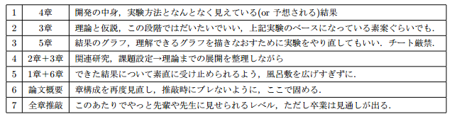

# 卒論が1ミリも進まない4年生におくる，TeX卒論サンプル

初稿2003-1-15, 2020-06-16移植, {{ site.time | date_to_string }} 更新


<h1>この記事は古い記事です(2013年初稿執筆)</h1>
<h2>関連情報</h2>

<blockquote class="twitter-tweet"><p>祝公式化！VRSJ大会2017テンプレ for CloudLaTeX（PNG画像，bibファイルサポート）
http://bit.ly/VRSJACloudLaTeX  #VRSJ</p>&mdash; Aki (@o_ob) <a href="https://twitter.com/o_ob/status/887924065297588224">July 20, 2017</a></blockquote>
<script async src="//platform.twitter.com/widgets.js" charset="utf-8"></script>


<h2>updates</h2>

<blockquote class="twitter-tweet"><p>tweet</p>&mdash; Aki (@o_ob) <a href="https://twitter.com/o_ob/status/399830962176933888">date</a></blockquote>
<script async src="//platform.twitter.com/widgets.js" charset="utf-8"></script>

<blockquote class="twitter-tweet"><p>自blogサイトの2013年のアクセス統計。まとまった記事はあまり書いてこなかったけど、卒論関係が時期になるとどっと増える。月間1万PVぐらい。TeXテンプレのダウンロード数も多い。 #Sotsuron</p>&mdash; Aki (@o_ob) <a href="https://twitter.com/o_ob/status/414592912278573056">December, 22, 2013</a></blockquote>
<script async src="//platform.twitter.com/widgets.js" charset="utf-8"></script>

<blockquote class="twitter-tweet"><p>tweet</p>&mdash; Aki (@o_ob) <a href="https://twitter.com/o_ob/status/416972043922325504">date</a></blockquote>
<script async src="//platform.twitter.com/widgets.js" charset="utf-8"></script>


<h1>INDEX</h1>
<ul>
<li>序文</li>
<li>まずは読んでいただきたい完成版</li>
<li>TeXサンプルに書かれている日本語から...</li>
<li>はじめに</li>
<li>卒論とは何なのか</li>
<li>TIPSと更新</li>
<li>関連リンク</li>
</ul>
<h2>待つ身はつらいものです</h2>
（2013年初頭のお話）研究室内での卒論提出締め切りまであと10日ほどだというのに，いまだに毎日学校に来ない4年生がいらっしゃいます．
年末年始も，この成人式の連休も，私は彼の言葉を信じ，適切な課題（これも今の段階では絶体絶命ラインを大きく下回っているが）を設定し，呼びかけ，時には直電もし，待っているのですが，見事に裏切られます．

（私がなめられているのかもしれませんが，社会もナメているのかもしれませんが）

彼らはきっと自分の卒業を信じていないのでしょう．

しかし待つ身というのはつらいものです．K君、R君、S君、N君…はやく論文構成を出していただきたいのですが…。

…と学生に無理な負荷をかけても仕方ないので，自分自身でもどれぐらい時間がかかるか体験してみようと思いました．

研究室内でのTeXによる卒論のサンプルを丁寧に作って，サンプルがてらの未推敲の文章をモリモリと書いてみます．
（本当はやらねばならない事務仕事や執筆仕事があるのですが）
2時間もするうちに10ページはかけたので以下，公開してみます．

<h1>まずは読んでいただきたい完成版</h1>

<!--<a href="http://aki.shirai.as/2013/01/tex-sample/sotsuron/" rel="attachment wp-att-6618">Sotsuron</a>(PDF)-->

(TeX一式)[SotsuronTeX.zip](./download/SotsuronTeX.zip)

<h4>#卒論が1ミリも進まない4年生におくる，卒論サンプル README</h4>
Version 1.1 20:07 2013/01/15

【執筆に使用した環境】

執筆に使用した環境としては，LabEditorとTeXインストーラ3もしくはLabTeX Installerだけです．

■Lab Editor
http://www.labeditor.com/

□LabTeX Installer
http://www.labeditor.com/labtexinst.html
もしくは

□TeXインストーラ3
http://www.math.sci.hokudai.ac.jp/~abenori/soft/abtexinst.html

最近の国際会議などでよく使われるifxetexを通したい人はTexインストーラ3のほうがおすすめかも．

【使い方】
TeXインストーラ3をインストールし，LabEditorをインストールし，セットアップ後，
Sotsuron.texをLabEditorで開いてビルド(F12)します．

基本的にはLabEditorのマニュアルに従ってください．
図はコマンドラインでebb filename.pngして，bbサイズを取得します．

【おことわり -disclaimer-】
著作権は白井暁彦に帰属します．将来的に更新します（推敲していないので）．
また本稿の内容は神奈川工科大学や白井研究室の特定の人物や特定の研究とは全く関係ありません．
どちらかというと，いままでの研究者人生，教育者，執筆者としての経験に基づいていますので，
中身的な保証もありません．フィードバックをいただけるのであれば幸いですが下の方法でお願いします．

【お問い合わせ】
メールは日に3桁超えるので，役に立ちません．
Twitter(@o_ob)ぐらいなら反応するかもしれません．
いずれにせよボランティアですから．
最新情報などはこちらへ
http://aki.shirai.as/2013/01/tex-sample/


【謝辞】
ベースはこちらのyosshi71jpによるTeX解説から作っています．ゼロから作りたい人はこちらをどうぞ．
そのほうが絶対勉強になりますって！
<a href="http://d.hatena.ne.jp/yosshi71jp/20101210/1292005429">http://d.hatena.ne.jp/yosshi71jp/20101210/1292005429</a>

<h1>TeXサンプルに書かれている日本語から…</h1>
<h5>＜以下，駄サンプル文から引用，改訂予定，上記PDFのほうが読み物としては読みやすいはず．以下，論述なので基本は「である調」であるべきだが、意図的に口語が混ざっていることに注意＞</h5>
<h2>はじめに</h2>
本論文はドラゴンクエストにおける魔法の命名規則におけるユーザビリティにおける雑文から，TeXを使った卒論執筆手法を整理するものである．
論文の要旨とは，その論文の主題や前提となる背景，論文の構成，研究の成果や価値を特徴付ける実験手法や結果について1ページ程度で凝縮して表現するものである．

文体として「まず１章では…，
次に２章では…，最後に３章では…，
以上のような構成において，新しい視点を整理した．」といったテンプレートに沿った文体になるべきで，随筆調になったり，（たとえ本当に精神的な支えであったとしても）家族や恋人，指導教官への愛敬の念を述べてはいけない．

執筆順としては，完璧に書けないまでも，論文要旨は「卒業するぞ」と心に近い，指導教員と論文のストラテジを相談した直後に書いてしまうのが良い．後から『う～ん，ここはどうかな～』といって直されてはたまったものではないだろう（先生もたまったものではないのだ）．

もちろん最初から完璧な論文要旨などかけるわけがない，しかし，骨子となる流れはできているべきなのだ．論文を「序論，本論，結論の3パートに分けよ」という指定がある大学もある．その場合は，どのパートが何章にあたるのか，示せる場所はここしかないし，ページボリュームを考える上でも，執筆終了できるまでの体力・時間配分もこの段階で設計されるべきなのである．
そして，最後に結論パートを書き終わった段階で，再度この要旨を推敲すれば良いのである．

本サンプルではドラゴンクエストにおける魔法の命名規則が出現するが，間違っても神奈川工科大学ではこのような学位論文を受け付けてはいないことを注記しておく．
また各大学・研究室では脈々と引き継がれてきた先輩方のテンプレや，先生方の指導方針があるはずである．そちらのほうが優先であることは間違いない．

```tex
%%% 目次
\tableofcontents
\mainmatter %%% 本文ここから

\part{序論} %3部構成を取る必要がない場合もあります
\chapter{はじめに}
```

<h2>\section{卒論とは何なのか}</h2>
卒業論文とは，大学を卒業するものが得る学士という称号と引き換えに書くものである．修士は修士論文，博士号あれば博士論文．
通常，「学位論文」と呼ぶ場合は博士論文を指すことが多い．

人によっては一生に一度の「名前の残る著作」であり，書く前と書いたあとでは，何かが違うはずである．

博士論文にもなれば数百ページを超える．人間として大切なものの1つや2つぐらい失う覚悟でなければ到底書ききれない．

学位論文は指導教員の指導に従い，フォーマットに沿った研究や執筆を行うことで，なんとか形になるものである．
修士論文では，学部時代に求められた問題解決能力に加えて，修士にふさわしい問題発見能力が備わっているかどうか，という点が多く見られるはずである．つまり研究として，本当に新規性があるかどうか（引用や予備調査など），客観的な品質が保たれているか（実験方法や誤差の扱い，再現性）などが重要である．

博士論文についてはここでは多くは語らない，ただ言えることは修士論文にページ数だけ多くなれば学位がもらえると言うことではないことである．
簡単にいえば，この学位論文を通して，人類の歴史にどのような意味をもたせ，新たな学際分野を創出していけるのか，といった点を示すための「点や直線ではない面積」が必要であることが多い．

こういった博士論文はすべて，大学の図書館および国立大学であれば国会図書館に収蔵されているはずである．
一方で，自信を持って「博士論文はこう書け！」といったお手本のようなものがないのも現実である．
誰もがそんな風に自信を持って博士号がとれるわけではない，本当に生きるか死ぬかのギリギリでもらえるラインであることが多いからである．

本サンプルではそのような切羽詰まった世界ではなく，
単なる\textbf{TeXで書く大きめの論文}を示すにとどまる．そのうち，気が向けば筆を執ることもあるかもしれないが，それはこれを活用した読者各位の心がけ次第といったところだろうか．

本サンプルが読者各位の人生の糧になる事を願ってやまない．

\section{課題の設定}
卒業研究において，最も最初に取り組むべき事はなんだろうか．

『就活が忙しくてそんなどころじゃなかったッス』という卒研生も多いだろう．
しかしながら，就活中の面接で「キミはどんな研究をしているのだね？」と聞かれなかった4年生はいないはずである．

その面接官は君に『マイクロソフトの新しいゲーム用コントローラであるKinect\texttrademark を使った，新奇なVRエンタテイメントシステムを開発しています』といった，超専門的で価値があるのかないのかわからない話をして貰いたいとは微塵も思っていないはずである．

問題は，その研究が
\begin{enumerate} %番号付き列挙．便利なので覚えるべし
\item 『どんな課題を解決しようとしているのか？』%ここに項目を書く
\item 『その課題解決はうちの業務に役に立ちそうか？』
\item 仮に役に立たなくても『そのガンバリはうちの業務に役に立ちそうか？』
\end{enumerate}

といった程度のことを聞いているに過ぎない．

このような背景において，間違っても

\begin{itemize} %ただの箇条書き，これも便利なので覚えるべし．
\item c++とC\#ではC\#のほうが得意です
\item Processingしか書けません
\item KinectはOpenNIもMicrosoft KinectSDKでもどっちでもいけます
\item 処理はGPU上で動いてます
\end{itemize}

なんていう話をしても仕方がないのである．
上記に列挙したような要素は，開発の中身であって，先端の研究をしている人間が，採用担当者や他の研究室の先生に『わかってもらおう』などという態度で前提をすっ飛ばして語っては，失礼千万あまりあまって，ただのギークと思われても仕方がない．

論文というものは，残念ながらインタラクティブ性をもたせることが難しい．
しかしながら，想定した読者に対して段階を踏ませることは可能である．
つまり，この章では『なんでそもそもこんな研究しとるねん』という「課題の設定」を行うべきなのである．
英語でわかりやすく言えば，\textit{motivation}である．
モチベーションがなければ，研究する意味もない．

そして，読み手にもそのモチベーションを共有させる必要があるのだ．

<h2>\section{陥りやすい罠}</h2>
この時期（論文執筆時点：2013年1月上旬），序論において陥りやすい過ちがある．
それはこのパートを「一番最初に書く」ということである．

%クォーテーションはこう書く↓
『なんだよさっき，``一番最初に''って言ったじゃないか！』とお怒りを受けそうだが，研究(\textit{re-search})を進める上で調査(\textit{search})をせよ，つまり先人の研究や論文検索をせよ，という前期のゼミで先生方が課しているようなアタリマエのことを述べただけであり，最初に書くのはせいぜいメモ程度，論文要旨程度の分量で構わない．

このパートは年末年始のコタツでTVなど見ながら書いていては，完全な随筆となってしまう．
資料として図書館で借りてきた図書をモクモク読みながら書いていても，
『ああ！俺の研究はどこまでもダメ研究だ！』という気持ちになってくる．

そしてどこまで書いても，
『ああ！この論文はこのペースで行くと100ページ超えてしまう……！今年は卒業無理かもしれない』という絶望感で覆われることになる．

だから書いてはいけないのだ．

もちろん，資料は借り給え．借りたら，有益そうなものはまず書名を文末にある引用文献リストに載せ給え．引用する必要があれば\ref{tex}といった形で本文で引用すれば良い．
図版なども同様である．
まずはスキャナでもスマホでもガラケーでもいいから図版を撮影し，画像の入れ方を学ぶべきである．
PNG図の入れ方がわかれば，あとからPowerPointでいくらでも清書したら良い．

書物を進める順番については次の章で述べる．

<h2>\chapter{執筆順序}</h2>
卒業論文に定められた執筆順序というものはない．
読み手からすれば「第1ページ，第1章から読むであろう」というナンバリングは存在するが，それも厳格に定められたルールではないだろう．

\fbox{読み手が正しく理解できるか}，という品質の問題と，\fbox{読み手と同じ順序で書く}という方法は一致している必要がない．

つまり，第1章から書くのは間違いである．
第1章は，読み手の第一印象である書き手の丁寧さや，前提知識の共有，課題の共有を行うべき，大事な章である．
初めて卒業論文を書くであろう，君がいきなり書いても，論文を書き終わる頃にはもっと大きくなった君がいる．
絶対に推敲したくなるに違いない．

では，どこの章から書くべきなのだろうか？
筆者おすすめの方法は以下のとおりである．


<!--[caption id="attachment_6630" align="alignright" width="637"]<a href="http://aki.shirai.as/2013/01/tex-sample/osusume/" rel="attachment wp-att-6630"></a> 下のTeXソースをコンパイルするとこのような美しい表になる[/caption]-->

<a href="./img/osusume.png" title="おすすめの執筆順序"></a>
下のTeXソースをコンパイルするとこのような美しい表になる

```tex
% 表の挿入
\begin{table}[h]
\caption{おすすめの執筆順序}% {}内に表題を書く
\begin{center}
\begin{tabular}{|c|c|l|} %セル内の位置｛c:センタリング，l:左寄せ｝，パイプ「|」縦罫線
\hline
1 &amp; 4章 &amp; 開発の中身，実験方法となんとなく見えている(or 予想される)結果 \\
\hline
2 &amp; 3章 &amp; 理論と仮説，この段階ではだいたいでいい，上記実験のベースになっている素案ぐらいでも． \\
\hline
3 &amp; 5章 &amp; 結果のグラフ，理解できるグラフを描きなおすために実験をやり直してもいい．チート厳禁． \\
\hline
4 &amp; 2章＋3章 &amp; 関連研究，課題設定→理論までの展開を整理しながら \\
\hline
5 &amp; 1章＋6章 &amp; できた結果について素直に受け止められるよう，風呂敷を広げすぎずに． \\
\hline
6 &amp; 論文概要 &amp; 章構成を再度見直し，推敲時にブレないように，ここで固める． \\
\hline
7 &amp; 全章推敲 &amp; このあたりでやっと先輩や先生に見せられるレベル，ただし卒業は見通しが出る． \\
\hline
\end{tabular}
\end{center}
\end{table}
```

以上のような流れで書いて見ることをおすすめする．

この流れは特に工学をベースとする学問を想定している．

<h2>\subsection{4章は``君なら書ける''}</h2>
4章は「動いているもんがあるんだから，書けるだろ」という考えでいい．
プログラミングをやめて，コメントやWikiを書くつもりで，コードの設計や，開発環境のセットアップなどを書き始めるのもエンジンがかかる．\footnote{実際には「開発環境などは付録に書け」と指導教員の指導を受けるだろう．だとしても，冬休み期間中に1ミリも執筆が進まないよりは，先生の血圧計は高まらないことが経験的に報告されている．}

\subsection{写真を撮れ}
まずは動いているものがあれば，写真を撮ろう．スクリーンショットを撮ろう．ソースコードの大事な場所や体験者の様子など，わかりやすい図（\textit{key figure}）を配置して，キャプションに，言いたかったことをしっかりメモしておこう．
先生にそれを見てもらえば大体のあらすじはわかる．言葉尻は優しくなり，血圧計の針も下がろうというものだ．

『動いているプログラムすらないんです……』という学生もいるだろう．
そんな時は引きこもりなどする必要はない．アンケートを作ればよいのだ．

\subsubsection{予備調査：アンケートを作り，結果を示す}
研究の核である実験に入る前に「予備調査」を行うべきである．

例えばコンピュータサイエンスに関わる研究分野でも，人間が関わる研究は多い．
しかし，『被験者』とあっさり述べたとしても，誰が被験者なのか，予備調査をしているのだろうか？

例えば『○○を用いたコミュニケーション支援の研究』といった研究テーマがあったとする．
しかし論文のどこを読んでも『誰が』，『誰を支援するのか』，『どのような人がその支援を必要としているのか』が明確にされていない論文を書くことはたやすい．

本人は2章の「先行研究」で述べたつもりである．
もしくは『先生の言うとおりにすすめたんですぅ……』という話かもしれない．
仮に引用があったとしても，時代も，対象も，コンテキストも違うのである．
被験者の予備調査，文系的には「マーケットリサーチ」ぐらいはしても良いだろう．

今日ではGoogle Docsを用いたGoogle Formによるアンケート作成が便利である．
先生に見せてみる事で，研究手法の前提を確認する事もできる．被験者依頼の事前入力にも使える．

何より，プログラミングを1行もしなくても，このアンケート作成をして家族だろうがバイト仲間だろうが彼女の友達だろうが入力してもらえば『それらしいグラフ』は誕生する．

最終的に先生が「そんなデータはこの論文に含めてはいけないよ」とおっしゃるかもしれない．
しかし，卒論が1ミリも進まない君にとっては重要なことではないだろうか．

<h2>\subsection{5章は分解すれば書ける}</h2>
次に「5章のグラフ」は価値が大きい．グラフは0.3～0.5ページに換算できる．学会発表やゼミなどでPowerPoint用にコチョコチョとした凝縮したスクリーンプレゼンテーション用の図を書いている学生がいるが，この際なので，そのPPTXファイルを論文執筆用にスライドページコピーを使って「分解」しよう．

例えば，ある実験のパラメータを$\left\{X,Y\right\}$とし，被験者が5名 $\left\{A,B,C,D,E\right\}$といたとしよう．
スクリーンプレゼンテーションでは1ページで終わらせる内容かもしれないが，今回の論文ではそれはいけない．
そんな濃縮度では読み手は全く理解できない．

まずパラメータX，次にY，被験者の年令や性別などの分類も「分解」する必要があるかもしれない．

単位や背景となる補足情報を含めて考えれば，それぐらいの希釈は必要である．
そもそもこれはスクリーンプレゼンテーションではなく，「紙媒体」なのである．
凝縮して見せることに意味はなく，またアニメーションも使えない．カラー印刷だって使えない可能性もある．

例えば，データ点「▲」などが詰まりすぎて見えないグラフなどはPowerPointでは許されるかもしれない．
しかし学位論文ではそのページが全てなのである．許される許されない以前の問題で，読めない．

\subsection{2章＋3章はひとつの章}
セオリー通り書くと，2章は「先行研究」であり，3章は「理論」である．

しかし，理論も先行研究も，初学者の端くれである4年生にはなんとハードルの高いことか．

先行研究の調査は日々の習慣である．
図書館に通い，学会に通い，ゼミに真剣に取り組み，足繁く論文や，先端の研究者をウォッチしてこそ，先行研究リストやBibtexのデータベースを構築できるものである．

しかし，冬休みに至るまで，動画ウォッチ三昧の日々を送ってきた君にとって，そんな蓄積を求めるのは『何かのハラスメントか』と思うに違いない．

<h2>\subsubsection{2章が書けない動画中毒者向けマッピング手法}</h2>
では，考え方を変えてみてはどうだろうか．
動画をウォッチしているのであれば，現在取り組むべき問題を見つかるはずである．最先端の「やってみた」ではこんなことが起きている，こんな動画が流行った，そんなポインタから，どんな研究者がこれをやっているのか，それは本当に新しいのか，など調査を始めればよいのである．

もちろんニコ動やYouTubeの動画URLは参考文献にはならない．しかし動画URLの引用1に対して，似たような分野の論文が2～3件は見つけられるはずだ．見つけられないなら君は情弱者だ．
いや百歩譲ってIPDLやUSPTOといった特許検索（最近はGoogleでもパテントサーチできる）を使えば，絶対に何か出てくるものである．

それらの要素をまずは紙に書き出してマップにしてみよう．
十字線を引いて，君の研究テーマの軸を適当に用意して，マッピングすればいい．

例えば最初は『重い／軽い』，『無意識／意識』といった適当な軸で構わない．
さらに何度かシャッフルして，先生や先輩に一度見せて，助けを求めながら，他者の研究をぶった切るラインを見つければ良い．

最後に，この論文，君の研究テーマにおいて「この課題について解決する」という結び方で語れるように，2章を配置すれば良い．
もちろん要素は3つぐらいあっても良い．この3要素は「解決すべき課題」として3章の「理論」で述べれば良い．

<h2>\subsubsection{3章はアルゴリズムがあれば書ける}</h2>
仮説や理論など，最初から書けるはずがない．

心配することはない，まずは上記の3要素が見つかれば，一旦4章と5章に戻り，実験を増やして，ちゃんと要素ごと解決すればよいのだ．

例えば解決すべき課題が3つあれば，3-1,3-2,3-3という構成になる，実験方法や開発物として4-1,4-2,4-3が生まれる．この中にスピンアウト作品が含まれることもある．
そして結果が5-1,5-2,5-3,さらに5-4として，別の意味を持った視点も生まれてくるだろう．

ではここで振り返って「3章で書くべきこと」は何なのだろうか？

それは「アルゴリズム」である．

理論化しづらい複雑で整理されていない現象を，その開発したシステムや仮説は整理してくれる．
式やフローチャートで表現出来れば十分アルゴリズム化することはできるだろう．
逆に，不確定な要素が残っているなら，もういちど実験方法から見なおしたほうがいい．

逆にここで，アルゴリズムに落とせないと，何の研究をしているのか全くわからない．
うまく，法則性や傾向などを語ることができれば，かなりの快感があるので頑張って欲しい．

ここでの頑張りは，見返りが大きい．

もしどうしても「言語的にしか表現できない現象」なのであれば，それは，仮説として論調を整えるしかない．
仮説として，誰も唱えていないことを2章で明らかにしておこう．
その仮説を裏付ける「当たり前の結果」を5章で示す準備も忘れずに．

<h2>\section{1+6章は最後に書け}</h2>
さて，3章で理論や仮説が成立すれば論文はひとつに繋がる．

<h3>\subsection{6章は``軽い妄想''でいい，将来的な意味を書こう}</h3>
おそらくこの段階の論文は，4章と5章が分厚く育ち，場合によっては「まだ開発と実験を繰り返している」という状態かもしれない．
このフェーズに入れば，論文はどんどんとページを増やすことができる．まずは写真を撮りまくってほしい．

しかしタイムリミットまであと数日という段階までこれを続けてはいけない．徹夜続きもそろそろ限界だろう．
「撮れない写真」を撮るために頑張るのではなく「\textit{ここは一旦筆を置く}」という姿勢をとるために，まずは開発を終わろう．

そして，将来的な開発要素を6章に書き連ねよう．
こんなことを実装したかった，こうあるべきだ，ここの最低品質なコードをどうにかしたい，その辺りは箇条書きメモ程度で書いて，あとで先生に表現を助けてもらえば良い．
どちらかというと，将来的にどうなるか，スケーラビリティが大きくなればどうなるか？といった事を書けば良い．

たとえば君の研究テーマが数年後に「Googleがはじめた」としたらどうだろうか？
君は悔しいかもしれないが，どうやったら「それを予測し得たか？」のほうが重要ではないか？

おすすめの方法は『予想図』をイラストレーションすることだ．
Google画像検索では出てこないぞ，自分で撮影するか，描くしかない．
ただし，動いているもので描写する必要は，ここではない．
フェイクでいいとは言わない，読み手が想像できる程度のリアリティがあればいい．

「軽い妄想」でいいので，将来的な意味を教えてほしい，という章であるべき．

<h2>\subsection{ついに1章に！}</h2>
なんだかおかしな話だが，これでやっと1章を書くだけのすべてが揃ったわけだ．
君はこの研究論文についてのすべてを知っている．
みんなが知っているあの研究，あの動画のあの技術，実はそうではない，こうすることでありえないことが起きる……
度重なる苦難，ありえない実装方法，裏付ける被験者データ……よくできた学位論文はよくできた長編SF小説のような読後感がある．

それを「あたかも想定内」であるかのように書くことができる時がきた．

さあ，1章を残り時間の「半分」をかけて，書けば良い．

<h2>\section{論文概要ふたたび}</h2>
言うまでもなく，ここで論文概要を加筆・推敲しよう．
間違っても途中で修正してはいけない，論文がブレると周りで巻き込まれる先生や先輩が可哀想だ．
できればA4いっぱいいっぱいに熱意を持って書こう．

<h2>\section{全章推敲}</h2>
全章推敲は100ページ近くになった論文に対して，無駄な紙の山ができ，本当に心苦しい．エコでないので一刻もはやく終わらせたいところである．
残念ながら，この作業は通常，時間終了まで何回やっても終わらないループである．

大事なことは以下のポイントだろうか．
```
\begin{enumerate}
\item たまには印刷してみる．紙のほうがはるかにはかどる（A5サイズなどでよい）．
\item 先生が修正指摘した箇所は二度と修正候補にならないように確実に修正する
\item 日付等のバージョン番号で管理し，古いバージョンのTeXは削除や変更ではなく保存しておく
\item 本気で最終版ならバインダーに入れて
\item 先生がブレることもある
\end{enumerate}
```

(1)は電車移動中やファミレスなどで気分転換作業するのに適している．

(2)は，学生は軽い気持ちで修正を反映し忘れるが，先生からすると\underline{一気に血圧が上がる反逆行為}である．本当に完全に修正完了しているならもう手を加えず，バインダーに入れ，TeXファイルはinputコマンドを使い分割してしまおう（本稿ではドラクエ魔法部分がそれにあたるので参考にされたし）．

(3)長い時間徹夜で校正作業を行なっていると，見落としも多くなる．表紙をうまく使うと日付で見分けることができる．そして古いものは箱にでも入れて視界から消そう．Amazon箱などが便利である．

(4)バインダーに入れて，表紙をつけるとそれらしくなる．卒業への実感がみえてくる．とおもいきや，表紙を糊付けしようにも，ノリが乾かない，最終タイトルそもそも決まってない，といった絶望的な「不測の事態」が目の前に明らかになるので，まちがっても締め切り当日朝などに作業してはいけない．もし締め切り直前に作業するなら「先生が設定した締め切り」の前日にこっそり作業し，先生の出勤前に机上に``耳を揃えて''提出しておくのがカッコイイ．その際に間違えても，捨て台詞的なことを言ってはいけない．

先生と君はバディのようなものだ．自分からラインを切るようなことは自殺行為である．君の学位審査が終わるまでは．

★そんな先生の指導ストレスを少しでも軽減するために書いたエントリー「<a title="Kindle Paperwhiteは論文校正に使えるか？" href="http://aki.shirai.as/2013/01/kindle-paperwhite-for-diploma-paper-review/" target="_blank" rel="noopener">Kindle Paperwhiteは論文校正に使えるか？</a>」もどうぞ．

```
% 図の挿入
\begin{figure}[htbp]
\begin{center}
\includegraphics[bb=0 0 432 576,width=5cm]{figall/phd101212s.png}
\end{center}
\caption{Piled Higher and Deeper:「``FINAL''.doc」(10/12/2012)より http://www.phdcomics.com/ 参照}
\label{http://www.phdcomics.com/comics/archive.php?comicid=1531}
\end{figure}
```

(5)最後に，先生も人間である．沢山の学生を同時に指導し，若い君たちの勢いに押されて何日も徹夜していれば，間違いもある．
そんな時には怒号に怒号や号泣で返すのではなく，まずは確かな方針に従うことだ．
そんな時に，論文概要は君を助けてくれるだろう．
だから今，卒論が1ミリも進まないい君は，いますぐ，先生と論文概要と章構成については合意を得て置かなければならない．

<h2>\section{一旦筆を置く前に}</h2>
以上の通り，一気に書き綴って見たが，お役に立てたら幸いである．

「右を左に，左を右に……」としている時間は，今はない．
いままで寝て過ごしてきたツケは，君が払わなければならない．
君の卒論を指導する先生も``もちろん''心中するつもりだが，同じ勢いで闘えば，若い君よりも先に倒れることは間違いないのだから．

ちなみに君が先に倒れるなら，先生は安心して家族のいる家に帰ることができる．
果たしてそれは幸せな終わり方だろうか？

代わりに，君の卒業は1年遠のき，就職先も失う．君は来年も同じ研究室にいられるかどうかもわからない．
君の親御さんの経済的ダメージもある．
どんなにお金持ちだったとしても，老後に予定されていた海外旅行は1回はなくなるだろう．
年下の兄弟がいれば，彼らは進学を諦めるかもしれない．
それは君の最後の踏ん張り次第なのである．

『先生，ここの直しは明日までに仕上げておきます！今日は帰ってお休みください！』
というセリフが自然と出てくれば一人前である．
一方で，
『先生，なんだか研究，面白くなってきちゃいました』
なんてセリフを1月の下旬に聞く絶望感は，正直殺人的である．

このサンプルを見て，少しでも良い学士が誕生することを願ってやまない．

<a name="tips"></a>

<h1>TIPSと更新</h1>
<h2>・目次にサブセクションまで含ませたい</h2>
https://twitter.com/o_ob/status/427780351356727297
デフォルトのままでは目次には「1.1」までは含まれても「1.1.1」までは含まれません．大学のフォーマットによっては「サブセクションまで目次に含める」などあると思いますので，

<pre>\setcounter{tocdepth}{2}</pre>
をプリアンブル部に加えて下さい．プリアンブルとはTeXファイル冒頭の「\documentclass[]{}」から「\begin{document}」までの間です．

<h2>・章タイトルを中央揃えしたい</h2>
未確認情報ですが，うちの学生いわく：
こちらのコードをプリアンブルに配置してください．こちらは，章番号が振られている標題のみセンタリングを行います．

<pre>\def\@makechapterhead#1{\hbox{}%
\vskip2\Cvs
{\parindent\z@
% \raggedright% オリジナルの定義(左揃え)
\centering% 中央揃え
% \raggedleft% 右揃え
\reset@font\huge\bfseries
\ifnum \c@secnumdepth &gt;\m@ne
\setlength\@tempdima{\linewidth}%
\vtop{\hsize\@tempdima%
\if@mainmatter% ← report クラスの場合この行不要
\@chapapp\thechapter\@chappos\\%
\fi% ← report クラスの場合この行不要
#1}%
\else
#1\relax
\fi}\nobreak\vskip3\Cvs}
</pre>
<h2>参考文献が[1]形式ではなく「上付きカッコ1)」だった</h2>
\usepackage{makeidx}の下，\makeindexの上に以下を書くと良いそうです．

<pre>\makeatletter
\DeclareRobustCommand\cite{\unskip
\@ifnextchar[{\@tempswatrue\@citex}{\@tempswafalse\@citex[]}}
\def\@cite#1#2{$^{\hbox{\scriptsize{#1\if@tempswa , #2\fi})}}$}
\def\@biblabel#1{#1)}
\makeatother 
</pre>
<h1>関連リンク</h1>
お茶の水女子大・伊藤先生による「修士論文の作り方」およびそこから他の先生方へのリンク

http://itolab.is.ocha.ac.jp/~itot/lecture/msthesis.html

【関連】

卒論、そろそろ図書館を本気で活用すべき時期。
http://aki.shirai.as/2014/01/why-you-dont-go-to-your-library/
